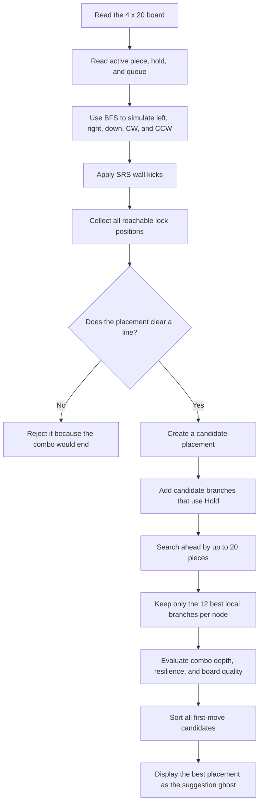
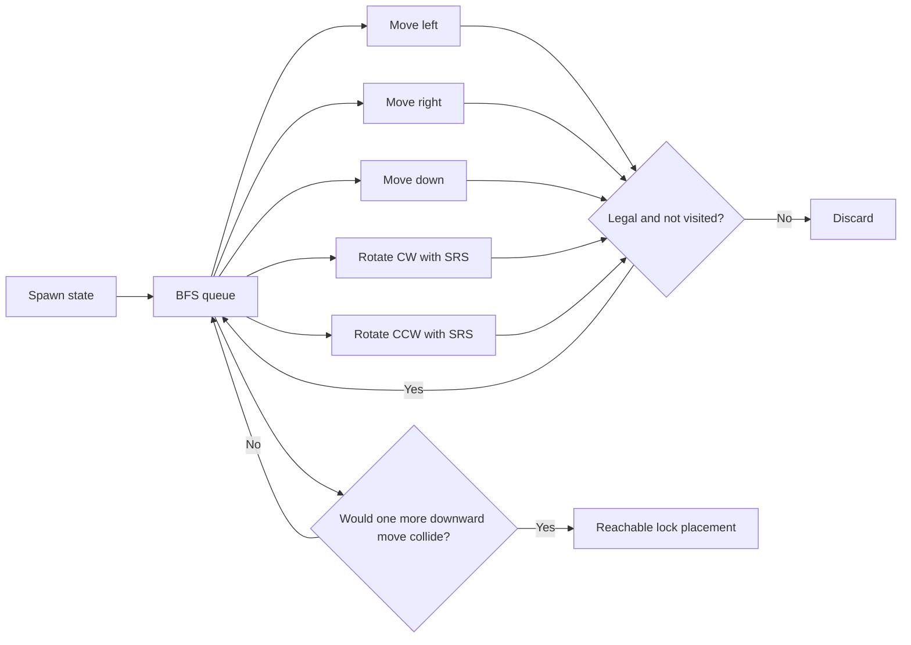
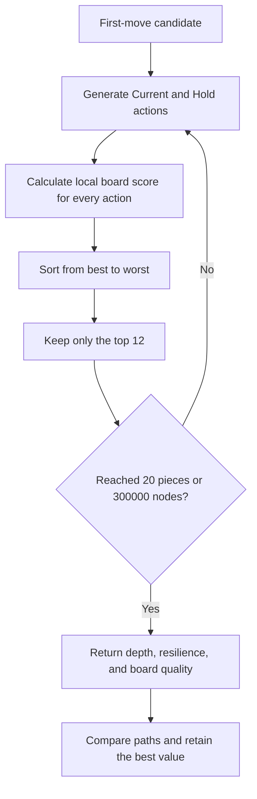

# TetraBoard Lab 4 Wide Suggestion Algorithm

This document explains the actual algorithm currently used by TetraBoard Lab to suggest placements in 4 Wide mode.

## In One Sentence

The program finds every placement that is **reachable under SRS and clears at least one line**, explores future choices using both the active and held pieces, and recommends the move that preserves the combo for the greatest number of pieces while keeping the board flexible and free of holes.

This approach can be described as:

> **Bounded Lookahead Heuristic Search**

It is not Monte Carlo search and it is not a machine-learning model. Given the same board, active piece, hold piece, and queue, it will normally produce the same suggestion.

## Overall Flow



## 1. Board and Piece Data

- Board size: `4 x 20`.
- Piece types: `I, O, T, L, J, S, Z`.
- Empty cells are represented by `EMPTY`.
- Each piece has four rotation states: `0, R, 2, L`.
- Rotation follows SRS.
- `I` and `J/L/S/T/Z` use their respective SRS wall-kick tables.
- `O` does not require kick displacement.

The queue follows the 7-bag randomizer. Each bag contains one of every piece and is shuffled with Fisher-Yates. A new bag is generated only after the current bag is exhausted.

The program maintains an internal queue of at least 24 pieces. The Preview control changes the visible preview between 3 and 5 pieces, but the search currently looks ahead by up to 20 pieces. Changing the visible preview count does not reduce the search depth.

## 2. Finding Reachable Placements

The program does not simply insert a piece into every coordinate. It starts at the spawn position and uses BFS, or Breadth-First Search, to simulate legal player actions:

- Move left by one cell
- Move right by one cell
- Move down by one cell
- Rotate clockwise
- Rotate counterclockwise

Every rotation applies the appropriate SRS wall kicks. States that collide with the board or leave its boundaries are rejected. A previously visited `(piece, rotation, x, y)` state is not processed again.



A state counts as a lock placement only when the piece cannot move down by one more cell. The piece is then merged into a copy of the board and every full row is cleared.

4 Wide mode requires every placement to preserve the combo:

- Clears at least one line: keep it as a candidate.
- Clears no lines: reject it immediately.

This rule is the main reason the algorithm avoids intentionally suggesting a combo-breaking move.

## 3. Active Piece and Hold Branches

At each search node, the program can generate two categories of action:

1. **Current:** Place the active piece directly.
2. **Hold:** Use the held piece. If Hold is empty, store the active piece and use the next piece from the queue.

After a Hold action, the search updates all related state:

- The next active piece
- The piece stored in Hold
- The remaining preview queue

The suggestion ghost may therefore display the held piece instead of the current piece when holding produces the better continuation.

If Hold has already been used for the active piece, `holdLocked` prevents another exchange. This matches the rule that each active piece may use Hold only once.

## 4. Lookahead Search

Every first-move candidate is simulated into the future with the following limits:

- Maximum lookahead depth: `20` pieces.
- Maximum retained branches per node: `12`.
- Maximum expanded nodes per analysis: `300,000`.
- Equivalent board, active piece, Hold, queue, and remaining-depth states are memoized.

The search is a recursive maximization search. It is not a complete brute-force search because enumerating every sequence across 20 pieces would create an enormous search tree. Candidates are first ranked by local board quality, and only the best 12 branches are explored at each node.



## 5. Board Quality Heuristic

The local `boardSurvivalScore` is calculated as follows:

```text
acceptable piece types x 1800
- holes x 4200
- maximum height x 180
- aggregate column height x 24
- surface bumpiness x 95
- occupied cells x 8
```

### Meaning of Each Metric

| Metric | Meaning | Preferred direction |
|---|---|---|
| Acceptable piece types | Number of the seven pieces that have at least one reachable line-clearing placement | Higher is better |
| Holes | Empty cells with at least one occupied cell above them | Lower is better |
| Maximum height | Height of the tallest occupied column | Lower is better |
| Aggregate height | Sum of all four column heights | Lower is better |
| Bumpiness | Sum of height differences between adjacent columns | Lower is better |
| Occupied cells | Cells remaining after line clears | Lower is better |

Holes receive the largest penalty because an inaccessible hole in a 4 Wide well can quickly remove every valid line-clearing continuation.

## 6. Comparing Future Paths

Recursive search results are compared in this order:

1. **Depth:** How many more pieces can continue clearing lines.
2. **Resilience:** The accumulated number of acceptable future piece types.
3. **Quality:** The accumulated board-quality score.

Continuing the combo for one additional piece is therefore more important than producing a slightly cleaner-looking board. Resilience and quality are used only when combo depth is equal.

Future board quality is discounted at every level:

```text
local quality + child quality x 0.55
```

Near-term board conditions have the greatest influence, while distant predictions still contribute with progressively lower weight.

## 7. Final Score for a Suggested Move

Each first-move candidate receives the following combined score:

```text
Completes the full lookahead: +1,000,000
Each continued piece:         +100,000
Future resilience:            x 1,000
Future board quality:         added directly
Current acceptable types:     x 250
Lines cleared now:            x 80
Uses Hold:                    -1
```

The `-1` Hold penalty is only a tie-breaker. If placing the current piece and using Hold produce otherwise identical results, the algorithm keeps Hold available.

Final candidates are sorted in this order:

1. Whether the complete lookahead remains combo-safe.
2. Number of continued pieces.
3. Number of acceptable next piece types.
4. Number of lines cleared by the current placement.
5. Lower surface height.
6. Combined score.

The first candidate after sorting becomes the displayed suggestion ghost.

## 8. Reset and the Five Openings

Entering 4 Wide mode or pressing Reset randomly selects one of five opening foundations:

| Type | Cells inside the board | Cell outside the board |
|---|---|---|
| S | `(1,1) (1,2) (2,2)` | `(0,1)` |
| I | `(1,1) (2,1) (3,1)` | `(0,1)` |
| T | `(1,1) (2,1) (1,2)` | `(0,1)` |
| J | `(1,1) (1,2) (1,3)` | `(0,1)` |
| L | `(1,1) (2,1) (2,2)` | `(0,1)` |

Coordinates use the bottom-left board cell as `(1,1)`. Cell `(0,1)` is directly outside the left edge of the four-column board. It is removed when the opening's bottom row is cleared.

Reset also generates a new 7-bag queue and recalculates the suggestion. If the initial queue cannot complete the full lookahead, the program retries with a new queue up to 20 times to find a more sustainable opening.

## 9. Auto Line Clear

When Auto is enabled, the program checks whether the active piece occupies exactly the same four cells as any suggested candidate.

- If it matches, a `0.5` second timer begins.
- If it remains in the suggested position for the full 0.5 seconds, the piece is locked, lines are cleared, and the next piece spawns.
- Moving or rotating away cancels the timer.

Auto only confirms and executes a suggested placement. It does not alter candidate evaluation.

## 10. Why a Combo Can Still End

The algorithm tries to avoid combo breaks, but it cannot mathematically guarantee an infinite combo:

- It searches at most 20 pieces rather than the infinite future.
- It retains only 12 branches per node, so a locally weaker but better long-term branch may be pruned.
- Analysis stops expanding nodes after reaching the 300,000-node budget.
- The current board may have no reachable placement that clears a line.
- If the player ignores the suggestion, the next analysis must continue from the resulting board.

These limits trade completeness for responsiveness. A mobile web app cannot exhaustively enumerate an unlimited future while continuously updating suggestions.

## 11. Simplified Example

Assume the active piece is `T`, Hold contains `I`, and the queue begins with `S, Z, O...`:

1. BFS finds every SRS-reachable placement where `T` clears a line.
2. The algorithm also finds every line-clearing placement for the held `I`.
3. Each placement is merged into a simulated board and its line clears are applied.
4. The search continues through `S, Z, O...`, considering Hold again for every later piece.
5. If a `T` placement survives for only 6 more pieces but an `I` placement survives the full 20, the ghost recommends the `I` placement.
6. If both survive all 20 pieces, holes, height, bumpiness, and future piece flexibility decide the winner.

## 12. Main Implementation Functions

| Function | Purpose |
|---|---|
| `shuffledBag()` | Creates and shuffles one 7-bag |
| `reachableLockPlacements()` | Uses BFS and SRS to find all reachable lock positions |
| `enumerateComboPlacements()` | Keeps placements that clear at least one line |
| `measureBoard()` | Measures heights, holes, bumpiness, and occupied cells |
| `boardSurvivalScore()` | Calculates local board quality |
| `comboSearchActions()` | Generates Current and Hold branches |
| `rankComboSearchActions()` | Ranks actions and keeps at most 12 branches |
| `searchComboContinuation()` | Recursively searches future combo continuations |
| `scoreTrainerCandidate()` | Calculates the score of a first-move candidate |
| `analyzeTrainer()` | Combines all candidates and selects the best suggestion |

Implementation: [web/app.js](web/app.js).

